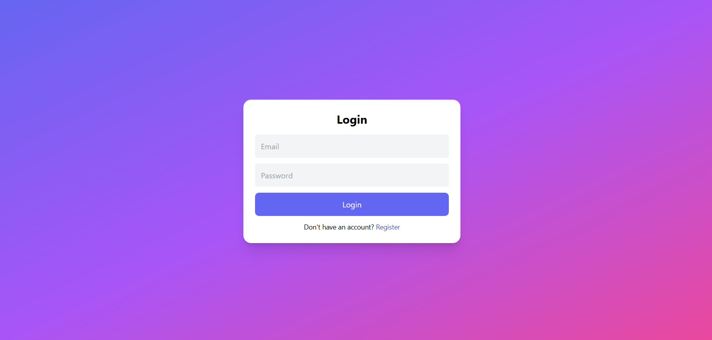
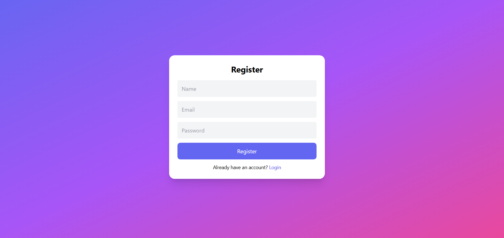
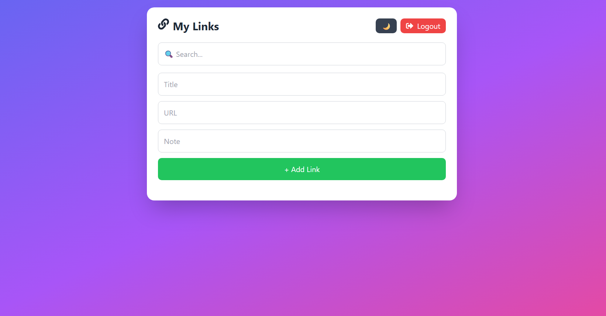
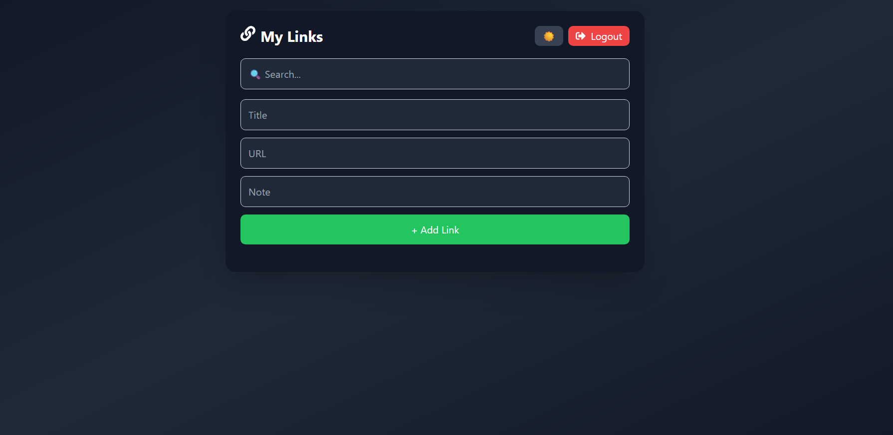

# 🔗 Smart Link Saver

A full-stack web application for saving, managing, and quickly finding important links in one place. Users can securely register, save links with notes, search their saved links, edit or delete them, and switch between light and dark mode.

## 🚀 Live Demo

**Live Demo:** https://smart-link-saver.vercel.app/

## ✨ Features

- 🔐 User registration and login
- 🔒 JWT-based authentication
- ➕ Save links with title, URL, and notes
- ✏️ Edit saved links
- 🗑️ Delete saved links
- 🔍 Search links by title, URL, or notes
- 🌙 Light/Dark mode
- 🔔 Toast notifications
- 🛡️ Protected dashboard
- 📱 Responsive design
- 💾 MongoDB data persistence

## 🛠️ Tech Stack

### Frontend

- React
- React Router
- Tailwind CSS
- Axios
- React Icons
- React Hot Toast
- Vite

### Backend

- Node.js
- Express.js
- MongoDB
- Mongoose
- JWT
- bcryptjs

### Deployment

- Vercel — Frontend
- Render — Backend
- MongoDB Atlas — Database

## 📁 Project Structure

```text
smart-link-saver/
│
├── client/
│   ├── src/
│   │   ├── components/
│   │   │   └── PrivateRoute.jsx
│   │   │
│   │   ├── pages/
│   │   │   ├── Login.jsx
│   │   │   ├── Register.jsx
│   │   │   └── Dashboard.jsx
│   │   │
│   │   ├── App.jsx
│   │   ├── main.jsx
│   │   └── index.css
│   │
│   ├── package.json
│   ├── tailwind.config.js
│   └── vite.config.js
│
├── server/
│   ├── config/
│   │   └── db.js
│   │
│   ├── controllers/
│   │   ├── authController.js
│   │   └── linkController.js
│   │
│   ├── middleware/
│   │   └── authMiddleware.js
│   │
│   ├── models/
│   │   ├── User.js
│   │   └── Link.js
│   │
│   ├── routes/
│   │   ├── authRoutes.js
│   │   ├── linkRoutes.js
│   │   └── testRoutes.js
│   │
│   ├── utils/
│   │   └── generateToken.js
│   │
│   ├── index.js
│   └── package.json
├── screenshots/
│   ├── login.png
│   ├── register.png
│   ├── dashboard.png
│   └── dark-mode.png
│
├── .gitignore
└── README.md
```

## ⚙️ Getting Started

### 1. Clone the repository

```bash
git clone https://github.com/urvijahir/smart-link-saver
cd smart-link-saver
```

### 2. Install dependencies

Frontend:

```bash
cd client
npm install
```

Backend:

```bash
cd ../server
npm install
```

### 3. Configure environment variables

Create a `.env` file inside the `server` folder:

```env
PORT=5000
MONGO_URI=your_mongodb_connection_string
JWT_SECRET=your_jwt_secret
```

### 4. Run the application

Start the backend:

```bash
cd server
npm run dev
```

Start the frontend in another terminal:

```bash
cd client
npm run dev
```

## 📸 Screenshots

### Login



### Register



### Dashboard



### Dark Mode



## 🔮 Future Improvements

- Forgot password and password reset functionality
- Link categories and tags
- Favorite/pin important links
- Link preview cards
- Custom folders
- Bookmark import/export
- Shareable link collections

## 👩‍💻 Author

**Urvi**

Front-End Developer

Built with React, Node.js, Express, and MongoDB.
